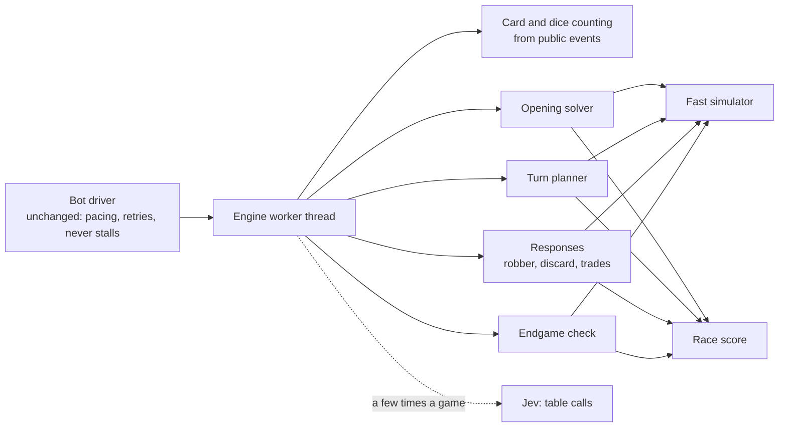

# The strongest bot we can build

A plan, not a commitment. It says why today's bots lose, what the research on
every serious Catan program teaches, and how to build a bot for Classic that
plays to win against people. The research itself, with sources, is in
[Catan AI research](BOT-RESEARCH.md). How today's bots work is in
[Bot players](BOTS.md).

The owner's brief (1 October 2026): build the strongest bot possible, at the
highest difficulty, because a strong bot is easy to tone down and a weak one
cannot be made strong. Keep Jev, but only for strategic calls; the bot's own
machinery plays the game.

## Status (1 October 2026)

Built in one pass, as `packages/bot/src/brain/`, and in production behind every
level (see [Bot players](BOTS.md)):

- the race score, card counting fed from the journal, the turn search, the
  opening solver, robber, discards and development cards by search (steps 2
  and 3);
- selfish trading with people in both directions, open offers included, and
  Jev as an advisor at close calls, with no quota (step 4);
- reactions: a face now and then, a burst for the big moments.

One change from the plan: instead of a second, compact simulator (step 1), the
rules engine gained `simulateAction`, which shares the board rather than
copying it, so the bot searches with the real rules and no differential test
is needed. A score still takes about a fifth of a millisecond, so a Champion
scores up to 2,000 positions a move.

Still to do: self-play tuning of the weights and a trained score (step 5),
counting the balanced dice deck, and measuring results against people.

## The short version

Today's bots do not think ahead. Every decision is a shortlist ranked by pips
and a choice from it, made by Jev or by a fixed order of preference. There is no
measure of how good a position is, no lookahead, no memory of what cards
opponents hold, and no trading with players. That is why Catanatron's simplest
scoring bot beats them 165 games to 35.

The research is clear about what works, because the same things show up in
every program that got strong:

1. **A score for the race to ten points.** How much a move speeds you up and
   how much it slows everyone else, measured in turns. This is JSettlers' idea,
   and it has the best record of anything tested against people.
2. **A real opening.** Better placement alone moved an otherwise identical bot
   from 15% to 28% of games. Top players put placement at 20 to 50% of the
   result.
3. **Search that knows Catan.** Trying moves on a copy of the game, rolling the
   dice forward with sensible play, and choosing the kind of move before the
   move. The best bot-against-bot results all come from search on top of Catan
   knowledge, and every learned bot that improved did so by adding search.
4. **Counting cards.** In Catan almost everything is public except steals. A bot
   that counted did as well as one allowed to see every hand.
5. **Trading well.** Among bots, trading roughly doubles a player's share of
   wins. Against people, careless trading loses games, and offer spam annoys.

Ours has none of the five. The plan builds all of them. The bot plays inside
the same view a person gets, so it stays honest.

Jev moves out of the per-move loop. The engine answers every move by itself, in
time, with or without the service. Jev is asked a handful of times a game, at
the calls the engine cannot measure: the ones about the people at the table.

## Be honest about "impossible to beat"

Catan has dice. No program can be unbeatable, and nobody should promise one.
The research is sobering on this: no Catan program has been shown to beat
strong people. The best evidence is JSettlers, which plays about as well as an
average online player; a bot built on Catanatron won 12.5 to 15% of 40 ranked
games on Colonist. So what we are building would already be beyond anything
published if it reliably beats good players.

What a bot can be is a player who is never outplayed: it wins far more than its
share over many games, punishes every mistake, and when it loses, loses to the
dice. The targets are set that way.

| Measure                                               | Today      | Target      |
| ----------------------------------------------------- | ---------- | ----------- |
| Head to head against Catanatron's AlphaBeta           | 1 in 5     | 2 in 3      |
| Four players: ours, AlphaBeta, Value, Weighted Random | 9 in 100   | most wins   |
| One of ours against three of today's Champion         | —          | 50 in 100   |
| One of ours against three regular human players       | unknown    | 40 in 100   |
| Time to decide, 95th percentile                       | under 5 ms | under 1.5 s |

A fair share at a table of four is 25 in 100. Forty against people would be a
clearly stronger player, and better than any published result.

Today's figures are in [Measured so far](#measured-so-far). Without Jev the
three levels are almost the same player: Champion and Steady both win about one
game in five against AlphaBeta.

## How it will work

The bot driver in `apps/server/src/bots.ts` stays as it is: think-time pacing,
command ids, retries, the rescue move after three failures. What changes is
what `decide` does. It hands the position to a worker thread running the
engine, gets back a move and a one-line reason, and falls back to a quick
greedy move if the worker misses its deadline.

### 1. A simulator fast enough to search

Our rules engine takes about 180 microseconds per action, and 170 of those are
spent copying the whole 15 KB game (`structuredClone` in `applyAction`). That is
fine for play and hopeless for search. Every serious search bot in the research
has its own fast simulator; inside JSettlers' engine, 1,000 simulations took
five minutes. A Rust engine from this year runs 87 to 221 nanoseconds a step.

The engine gets its own compact copy of Classic: the board as fixed lookup
tables built once per game, and everything that changes packed into one small
typed array of about 700 bytes. Copying a position is one memory copy. Moves
come from the lookup tables, and longest road is recomputed only for the player
whose road changed. The target is about a microsecond a step in TypeScript.

It must never disagree with the real rules. A differential test plays thousands
of random games through both and compares, after every action, the legal
moves, hands, points and awards. The real rules engine stays the authority: the
engine only proposes moves, and the server applies them through `Store.action`
like any other.

### 2. Card and dice counting

Almost everything in Catan happens in public: dice income, building costs,
bank and harbour trades, player trades, discards, Monopoly and Year of Plenty.
Only a steal hides which card moved, and only from the players not involved.
The bot keeps, for every opponent, an exact count where the count is known and
a small set of possible hands where a steal made it uncertain. The research
measured how small: when a hand was uncertain there were three possibilities at
the median, and a bot that could see every hand did no better than one that
counted.

Development cards get the same treatment. The deck is 14 knights, 5 points and
2 each of the others; what has been bought and played is public, so the chance
that an opponent is sitting on hidden points follows from the cards not yet
seen. Four unplayed cards can hide three points, and strong players watch for
exactly that.

In a room with balanced dice, the dice are a deck of the 36 combinations,
refilled every 24 rolls, and every roll is public. The bot tracks what is left
in the deck and knows the real odds of each total, as a person with a notepad
could.

This needs a structured public event feed per seat, with the facts the move
history already shows, instead of the text log. Nothing hidden goes into it: a
bot learns only what a player watching every move would know.

### 3. The race score

One function that turns a position into a winning chance for every player,
built around the race to ten points.

- **Turns to win**, from JSettlers: from each player's dice income and
  harbours, how many turns until each purchase is affordable, then how many
  turns to ten points buying the cheapest points first. A move's value is how
  much it cuts the bot's own turns to win plus how much it adds to everyone
  else's; Thomas found weighting the two equally worked best.
- **The features Catanatron's score gets right:** points, production by resource
  with the robber's tile removed, variety, the production of free corners one
  road away, how many corners are still buildable, and how close the hand is to
  a city or a settlement.
- **What both miss:** scarcity of each resource on this board, pairing (timber
  with clay, rock with hay), harbours valued by the production they can convert,
  expected hidden points, the chance of losing half the hand to a seven before
  the next turn, the knights and roads each player needs to take an award, and
  whether taking it wins them the game.

Each player's features become a strength, and the strengths become winning
chances that add up to one. Winning chance is the right unit because every
decision then uses the same currency: blocking the leader, refusing a trade,
robbing one player rather than another all come down to what the move does to
the bot's chance of winning.

The weights are first set by hand, then tuned by self-play: many games between
slightly different weights, keeping whatever wins more (Catanatron's author
found SPSA, a method from chess engines, worked where Bayesian optimisation did
not). Development cards in particular are tuned, not guessed: the Edinburgh
work found a naive estimate bought far too many. Later, the same inputs feed a
small neural network trained on millions of self-play positions, small enough
to run in microseconds in plain TypeScript.

### 4. The turn planner

After the roll, the planner lists the useful ways to spend the turn: sequences
of trades, purchases and development cards, merged when they lead to the same
position, choosing the kind of move before the move so that trade offers do not
swamp everything else. The best dozen by score go forward. For each, it rolls
the dice forward through every opponent's turn to the start of its own next
turn, many times, with opponents playing a fast sensible policy, and averages
the winning chance at the end. Every candidate sees the same dice sequences, so
the comparison is fair and needs fewer samples. Where an opponent's hand is
uncertain, each run draws one of its possible hands and plays that out, which
the research found as good as anything more elaborate.

This is the search that makes a bot patient. It sees that holding rock and hay
for a city next turn beats a road now, that nine cards are a risk with three
opponents still to roll, and that the leader builds a city next turn unless the
robber lands on their rock.

The planner is anytime: it keeps refining until its time is up, then answers.
Decisions outside the turn, such as a knight before rolling, use the same
machinery on fewer choices. If the planner plateaus, the next step is a full
tree search in the Edinburgh style (typed moves, sampled hands, a prior on what
people do), which reached 54% against three of their best rules bots.

### 5. The opening

The largest single lever measured, so it gets the most time (the driver already
pauses two to four seconds). For each strong candidate corner and road, the
solver plays out the rest of the placement round many times: opponents pick from
a model of how people choose (strong spots, not always the very best), and the
bot takes its own second pick knowing its first. It scores each finished opening
with the race score and short simulated games, and takes the corner that does
best on average. It is built to cover every combination; the Catanatron-based
bot on Colonist could not, and its openings suffered for it.

It weighs what top players weigh: pips counted per resource on this board, the
scarce resource on ties, numbers spread rather than repeated, never both
settlements on one tile, the second settlement filling the first's gaps (or
deliberately narrow on great numbers), timber and clay for a starting road that
wins the race to the next corner, a harbour that fits the production, where the
desert sits, and which corners the next players will take.

### 6. Trading with people

Today's bots never answer a trade offer and never make one. The research shows
both sides of this: among bots, trading doubles a player's share of wins; a
learned trader took a bot from 25% to 53%; a random trader almost never won;
and against people, JSettlers' first trading logic lost it games. So the bot
trades carefully, and prices every trade with the same score:

- **Answering:** accept when the trade raises the bot's winning chance by more
  than it raises the other player's, it beats what the bank or a harbour would
  give, and the other player is not the leader or racing the bot for a corner.
  From about 7 points the leader gets nothing; the research found JSettlers'
  8 too late.
- **Offering:** only toward a purchase the bot can make this turn, to the player
  counting says holds the card, preferring players who are behind. A card
  usable on the giver's own turn is priced higher.
- **Never a gift:** no two-for-one to anyone whose hidden points could make it
  decisive. That is exactly how Bo Peng, a national champion, won from four
  visible points.
- **Restraint:** at most three offers a turn. Unlimited offers made search bots
  worse and annoyed people, and a refusal tells the bot something about that
  player's hand.

This is where a calculating player beats people most, and where no research bot
has done well against them.

### 7. Robber, knights and development cards

These fall out of the search rather than fixed rules:

- the robber goes where it cuts the most winning chance, judged the way strong
  players judge the leader: points, production, unplayed cards, award prospects,
  harbours, and whether any roll wins them the game. It steals from the hand
  most likely to hold what the bot needs. When nobody is clearly ahead, it does
  not hit the same person twice in a row: people retaliate;
- a knight is played before the roll when the robber sits on the bot's own
  production, to take or defend largest army at the right moment, or to win;
- Monopoly waits for five or more counted cards, or for a winning turn;
- Year of Plenty and Road Building are chosen by what they let the bot build
  this turn;
- point cards stay hidden until they win the game.

### 8. The endgame

When anyone is within reach of winning, the bot searches its own turn
exhaustively: every order of trades, purchases and cards, hidden points,
longest road taken with Road Building, largest army taken with a knight. If a
win exists it takes it. If an opponent could win next turn, it picks the turn
that makes that least likely: the robber on their key tile, a steal, a Monopoly
on the resource they need, a road that breaks theirs, and no trades with them.
JSettlers failed exactly here, building a settlement instead of the road that
would have stopped a player on nine.

### 9. Reading the table

During a game the bot keeps a light record of each opponent: how often they
accept trades, whom they rob, whether they hoard, what they seem to be building.
The search uses it to predict robber placement and trade answers. Later,
Catanova's own games can teach this better: sixty human games, used as a prior
on what kind of move people make, gave the Edinburgh search seven points at no
extra cost.

The bot never chats. A chatty bot in the research looked like a threat and was
ganged up on.

### 10. Where Jev fits

The owner's instinct is right, and the research backs it: language models were
weak move-by-move players in every study, and chat from a bot backfired with
people. So the engine plays the game and Jev is a small advisor it calls
rarely.

One refinement makes Jev worth calling. Asking it to break a tie between two
moves the engine rates as equal gains almost nothing, because the two moves are
nearly equal by definition. Jev is worth asking where the engine is blind:
questions about the people at the table rather than the board.

- **When:** a few junctures a game (the opening plan, a trade with a person, who
  the real threat is late in the game), and only when the engine is uncertain
  and the stakes are high. About five calls a bot per game, well under a cent.
- **What it sees:** the engine's shortlist with its numbers and what the bot has
  learnt about each player. Never raw state, never anything hidden.
- **How much it counts:** its answer shifts the engine's estimate and never
  overrides it. A move the engine rates clearly worse is never played because
  Jev liked it.
- **Off the critical path:** a one-second limit, the engine's own answer when
  there is no reply, and the circuit breaker as today.

This is not something to keep re-testing. The engine's gains are measured
anyway, and Jev's disagreements with the engine are logged; one look at that
log once the engine is finished settles whether it earns its place.

### 11. Time and the server

The engine runs in a worker thread, so a long think never blocks the game
server. Each decision has a budget: about a quarter of a second for routine
turns, a second for the robber, trades and development cards, up to three
seconds for the opening. The driver's think-time pauses already absorb this,
because thinking counts toward the pause, so a bot feels exactly as it does now
and is actually thinking during the pause.

The production VM has two burstable cores. At about 50 to 70 real decisions a
bot per game and 300 ms each, one bot costs 15 to 20 seconds of processor time a
game; a hundred bot games a day average out at a few percent of one core. If
bot games ever become the main load, the engine can move to its own small
machine.

### 12. Levels

The top level is the full engine. Easier levels are the same engine held back:
less time, sometimes a good move rather than the best, no counting, looser
trading. A level is tuned down by turning those dials until its results against
people sit where we want them.

### 13. The arena

Nothing ships on a hunch. A self-play arena runs thousands of games on a
development machine:

- today's bots, earlier versions of the engine, and Catanatron's Value and
  AlphaBeta through the existing bridge;
- four-player tables first, because habits learnt head to head fail at a table
  of four (the Colonist bot's did), with two and three players as well;
- 2,000 games per four-player comparison, which tells 25% from about 22.5 to
  27.5%, and a sequential test that stops early once a change is clearly better
  or worse;
- a regression gate: a new version must beat the last before it replaces it.

The same arena tunes the weights and later trains the network. Several
published comparisons rested on 10 to 25 games; ours will not.

## Order of work

Each step ends with a measured result, so progress shows early.

| Step | What is built                                                                | Gate                                                   |
| ---- | ---------------------------------------------------------------------------- | ------------------------------------------------------ |
| 1    | Fast simulator, differential test against the rules, arena, baselines        | Agrees with the rules over 10,000 games                |
| 2    | Race score, card and dice counting, greedy play, opening solver              | Beats Catanatron's Value bot head to head              |
| 3    | Turn planner, robber, discards, development cards, endgame                   | Beats AlphaBeta 3 in 5; 45 in 100 against 3 Champions  |
| 4    | Worker thread, time budgets, player trading, table reading, Jev at junctures | Ships as a new top level in Classic                    |
| 5    | Self-play tuning of the weights, then a small trained score                  | Each version beats the last; the targets above are met |
| 6    | Levels below the top rebuilt from the engine; measured against people        | Human results sit where the owner wants them           |

Steps 1 to 3 are about two to three weeks of focused work, step 4 about one
more, and step 5 runs as long as it keeps paying. Bots stay in Classic, as
decided for the modes. Big Table and Open Sea can follow once the engine is
proven, because the simulator's board tables are built per game.

## What we keep and what goes

Kept from today's bots: the honest view (`gameView` only), the driver's pacing
and safety, the rescue move, and the one-line explanation a player reads.

Taken from the research: JSettlers' race to ten and its trading discipline,
Catanatron's score features and its tuning method, the Edinburgh lessons
(typed search, sampled hands, a small human prior, offer caps), Rubin's idea of
treating trades as extra moves in the search, and the checklists of top human
players.

Dropped: Jev in every move, ranked shortlists as the bot's whole thinking,
lookahead counted in single actions, opponents treated as pure enemies, random
simulations, learning from scratch, and chat.

## Risks

- **The simulator drifting from the rules.** Answered by the differential test,
  and by the rules engine staying the only authority on what happens.
- **Too slow on the server.** Answered by the worker thread, time budgets and a
  greedy fallback that is already stronger than today's bot.
- **Strong against bots, weaker against people.** People trade, bluff and gang
  up. The trading and table-reading steps exist for this, and results against
  people are measured, not assumed.
- **Too strong to be fun.** That is what levels are for.

## Decisions for the owner

1. The name of the new top level, and whether it replaces Champion or sits
   above it.
2. Whether a host can pick the top level, or it only turns up by draw as today.
3. Whether the bot may make trade offers to people unprompted, or only answer.
4. Whether Catanova's own game records may be used to teach the bot how people
   play. They never leave our server.

## Measured so far

Base game, Catanatron as referee, our bot seeing only its own view. AlphaBeta
and Value are Catanatron's bots; AlphaBeta sees every hand, ours does not.

| Match                                             | Result              |
| ------------------------------------------------- | ------------------- |
| Champion against AlphaBeta, head to head          | 41 in 200           |
| Steady against AlphaBeta, head to head            | 20 in 100           |
| Steady with Jev against AlphaBeta                 | 15 in 100           |
| Steady against Value, head to head                | 35 in 200           |
| Four players: AlphaBeta, Value, Steady, W. Random | 50, 41, 9, 0 of 100 |
| AlphaBeta against Value                           | 52 to 48            |

An earlier run labelled "Champion" passed a level name the bot does not know
and so played as Steady, which includes the run with Jev. Champion with Jev has
not been measured, and under this plan it does not need to be.
