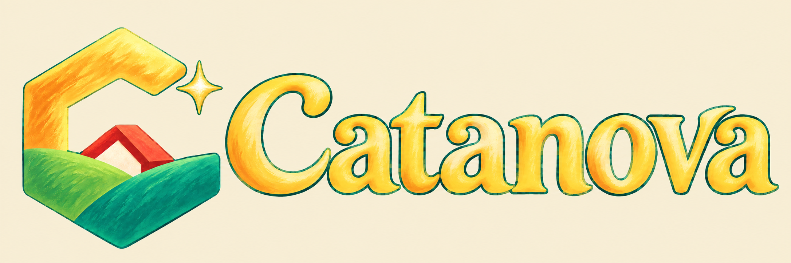

# Catanova identity

The open hexagonal **C**, green island forms, coral settlement roof and small nova spark remain the identity. The second version lifts the shadows and uses sunlit honey gold, fresh green and jade. Its full logo adds matching painted **Catanova** lettering.

- [Standalone mark](../../../apps/client/public/art/branding/catanova-mark-v2.png): 1254 × 1254, with real transparent alpha. Meaningful alpha ≥ 8 bounds are `[156, 116, 1116, 1206]`; a display viewBox of `145 105 983 1113` avoids unnecessary margins without modifying the source PNG.
- [Full logo](../../../apps/client/public/art/branding/catanova-logo-v2.png): 2172 × 724, **opaque warm cream background**, approximately `#f5ebd0`. It is suited to a warm cream brand area. Background extraction attempts returned baked checkerboards, so those variants are excluded. Do not treat this file as transparent.
- [Size and background preview](preview.html): selected source files shown through CSS/SVG sizing only.
- [Current provenance](provenance-v2.json): exact prompts, references, hashes, inspection and generation history.

The selected source files are copied unchanged from the built-in image generation tool. No raster cropping, recoloring or alpha processing was applied. “Painted” describes the appearance of this **AI-generated** artwork, not human authorship.

The darker v1 mark and launcher icon have been removed from the current tree to avoid storing duplicate superseded artwork. Their [historical provenance](provenance.json) remains, and the images are recoverable from commit `7c1f97db51de676e16aaebb79bed6ed0abf89267` under `docs/art/logo-concepts/`. These assets do not change board pieces or the separate in-game icon system.
